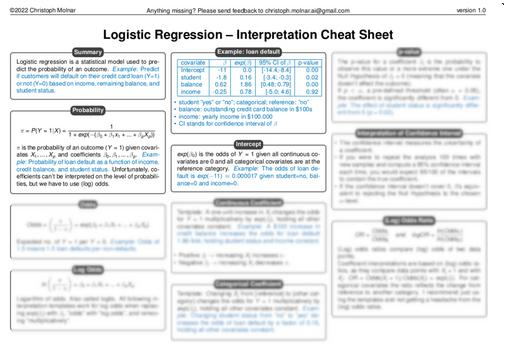

# Lojistik Regresyon {#logistic}



Lojistik regresyon, iki olası sonucu olan sınıflandırma problemlerinde olasılıkları modeller.
Doğrusal regresyon modelinin sınıf sonuçlarına yönelik bir uzantısıdır.[^actually-probabilities]


::: {.content-visible when-format="html:js"}

::: {.callout-tip}

::: {layout="[60,40]"}

Lojistik regresyon modellerinin doğru yorumunu mu arıyorsunuz?
Kendinizi zamandan ve baş ağrısından kurtarın (log-odds, kimse var mı?) ve yazarın [lojistik regresyon yorumlama kopya kâğıdına](https://christophmolnar.gumroad.com/l/logistic-regression) göz atın.

{width=60%}

:::

:::

:::


## Sınıflandırma için doğrusal regresyon kullanmayın

Doğrusal regresyon modeli regresyon için iyi çalışabilir, ancak sınıflandırmada başarısız olur.
Peki neden?
İki sınıf söz konusu olduğunda, sınıflardan birini 0, diğerini 1 ile etiketleyip doğrusal regresyon kullanabilirsiniz.
Teknik olarak bu işe yarar ve çoğu doğrusal model yazılımı size ağırlıkları hesaplayıp verir.
Ancak bu yaklaşımın bazı sorunları vardır:
Doğrusal model olasılık üretmez; sınıfları sayı (0 ve 1) olarak ele alır ve noktalarla hiperdüzlem arasındaki uzaklıkları en aza indiren en iyi hiperdüzlemi (tek bir öznitelik için bu bir doğrudur) uydurur.
Dolayısıyla yalnızca noktalar arasında ara değer kestirimi (interpolasyon) yapar ve çıktıyı olasılık olarak yorumlayamazsınız.

Doğrusal model ayrıca dış değer kestirimi (ekstrapolasyon) yaparak sıfırın altında ve birin üstünde değerler de üretir.
Bu, sınıflandırma için daha akıllıca bir yaklaşım olabileceğinin iyi bir işaretidir.

Tahmin edilen sonuç bir olasılık değil, noktalar arasında doğrusal bir ara değer olduğundan, bir sınıfı diğerinden ayırabileceğiniz anlamlı bir eşik değeri yoktur (bkz. @fig-linear-class-threshold).
Bu sorunun iyi bir açıklaması [Stackoverflow](https://stats.stackexchange.com/questions/22381/why-not-approach-classification-through-regression)'da verilmiştir.

Doğrusal modeller, çok sınıflı sınıflandırma problemlerine genişletilemez.
Bir sonraki sınıfı 2, ardından 3 ve bu şekilde etiketlemeye başlamanız gerekirdi.
Sınıfların anlamlı bir sırası olmayabilir, ancak doğrusal model öznitelikler ile sınıf tahminleri arasındaki ilişkiye tuhaf bir yapı dayatır.
Pozitif ağırlığa sahip bir özniteliğin değeri ne kadar yüksekse, daha yüksek numaralı bir sınıfın tahminine o kadar fazla katkıda bulunur; üstelik birbirine yakın numaralar almış sınıflar, diğer sınıflara kıyasla aslında birbirine daha yakın olmasa bile.

```{r}
#| label: fig-linear-class-threshold
#| fig-cap: "Tümör büyüklüğüne dayanarak (simüle edilmiş) tümör tipini tahmin etmek için bir doğrusal modelin kestirilmesi. Üst üste binmeyi azaltmak için noktalara hafif rastgele kaydırma (jitter) uygulanmıştır. Sol: 0,5'lik bir kesim noktası kabul edilebilir bir sınıflandırıcı verir. Sağ: Yalnızca iki veri noktası daha eklemek regresyon kestirimlerini tamamen değiştirir ve 0,5'lik kesim noktasını anlamsız kılar. Model ayrıca 1'den büyük tahminler de üretir."
#| fig-asp: 0.5
df = data.frame(x = c(1,2,3,8,9,10,11,9),
  y = c(0,0,0,1,1,1,1, 0),
  case = '1) 0.5 threshold ok')

df_extra  = data.frame(x=c(df$x, 7, 7, 7, 20, 19, 5, 5, 4, 4.5),
  y=c(df$y, 1,1,1,1, 1, 1, 1, 1, 1),
  case = '2) 0.5 threshold not ok')

df.lin.log = rbind(df, df_extra)
p1 = ggplot(df.lin.log, aes(x=x,y=y)) +
  geom_point(position = position_jitter(width=0, height=0.02)) +
  geom_smooth(method='lm', se=FALSE) +
  my_theme() +
  scale_y_continuous('', breaks = c(0, 0.5, 1), labels = c('benign tumor', '0.5',  'malignant tumor'), limits = c(-0.1,1.3)) +
  scale_x_continuous('Tumor size') +
  facet_grid(. ~ case) +
  geom_hline(yintercept=0.5, linetype = 3)

p1
```


## Teori

Sınıflandırma için bir çözüm lojistik regresyondur.
Lojistik regresyon modeli, bir doğru ya da hiperdüzlem uydurmak yerine, doğrusal bir denklemin çıktısını 0 ile 1 arasına sıkıştırmak için lojistik fonksiyonu kullanır.
Lojistik fonksiyon şu şekilde tanımlanır:

$$\text{logistic}(\mathbf{z})=\frac{1}{1+\exp(-\mathbf{z})}$$

Lojistik fonksiyonun grafiği aşağıda verilmiştir (bkz. @fig-logistic-function).

```{r}
#| label: fig-logistic-function
#| fig-cap: "Lojistik fonksiyon 0 ile 1 arasında sayılar üretir. Girdi 0 olduğunda çıktı 0,5'tir."
#| fig-width: 4.5 
#| out-width: 80%
#| fig-asp: 0.5

logistic = function(x){1 / (1 + exp(-x))}
x = seq(from=-6, to = 6, length.out = 100)
df = data.frame(x = x,
  y = logistic(x))
ggplot(df) + geom_line(aes(x=x,y=y)) + my_theme()
```

Doğrusal regresyondan lojistik regresyona geçiş oldukça basittir.
Doğrusal regresyon modelinde, sonuç ile öznitelikler arasındaki ilişkiyi doğrusal bir denklemle modellemiştik:

$$\hat{y}^{(i)}=\beta_{0}+\beta_{1}x^{(i)}_{1}+\ldots+\beta_{p}x^{(i)}_{p}$$

Sınıflandırmada 0 ile 1 arasında olasılıklar tercih ederiz; bu yüzden denklemin sağ tarafını lojistik fonksiyonun içine alırız.
Bu, çıktının yalnızca 0 ile 1 arasındaki değerleri almasını zorunlu kılar.

$$\mathbb{P}(Y^{(i)}=1)= \text{logistic}(\mathbf{x}^{(i)T} \boldsymbol{\beta}) = \frac{1}{1 + \exp(-(\beta_{0} + \beta_{1} x^{(i)}_{1} + \ldots + \beta_{p} x^{(i)}_{p}))}$$

Tümör büyüklüğü örneğine yeniden dönelim.
Ancak bu kez doğrusal regresyon modeli yerine lojistik regresyon modelini kullanıyoruz ve çok daha iyi uyum sağlayan bir eğri elde ediyoruz; bkz. @fig-logistic-class-threshold.

```{r}
#| label: fig-logistic-class-threshold
#| fig-cap: "Sol: Simüle edilmiş tümör verisine dayanarak tümör büyüklüğünden tümör sınıfını tahmin etmek için uydurulmuş lojistik regresyon modeli. Sağ: Lojistik regresyon, iki aykırı değer eklendiğinde bile sağlam (robust) kalır."
#| fig-asp: 0.5
logistic1 = glm(y ~ x, family = binomial(), data = df.lin.log[df.lin.log$case == '1) 0.5 threshold ok',])
logistic2 = glm(y ~ x, family = binomial, data = df.lin.log)

lgrid = data.frame(x = seq(from=0, to=20, length.out=100))
lgrid$y1_pred = predict(logistic1, newdata = lgrid, type='response')
lgrid$y2_pred = predict(logistic2 , newdata = lgrid, type='response')
lgrid.m = data.frame(reshape2::melt(lgrid, measure.vars = c("y1_pred", "y2_pred")))
colnames(lgrid.m) = c("x", "case", "value")
lgrid.m$case = as.character(lgrid.m$case)
lgrid.m$case[lgrid.m$case == "y1_pred"] = '1) 0.5 threshold ok'
lgrid.m$case[lgrid.m$case == "y2_pred"] = '2) 0.5 threshold ok as well'
df.lin.log$case = as.character(df.lin.log$case)
df.lin.log$case[df.lin.log$case == "2) 0.5 threshold not ok"] = '2) 0.5 threshold ok as well'


p1 = ggplot(df.lin.log, aes(x=x,y=y)) +
  geom_line(aes(x=x, y=value), data = lgrid.m, color='blue', size=1) +
  geom_point(position = position_jitter(width=0, height=0.02)) +
  my_theme() +
  scale_y_continuous('Tumor class', breaks = c(0, 0.5, 1), labels = c('benign tumor', '0.5',  'malignant tumor'), limits = c(-0.1,1.3)) +
  scale_x_continuous('Tumor size') +
  facet_grid(. ~ case) +
  geom_hline(yintercept=0.5, linetype = 3)

p1
```

Lojistik regresyonla sınıflandırma daha iyi çalışır ve her iki durumda da eşik değer olarak 0,5'i kullanabiliriz.
Ek noktaların dahil edilmesi, kestirilen eğriyi pek etkilemez.

## Yorumlama

Lojistik regresyondaki ağırlıkların yorumu, doğrusal regresyondaki ağırlıkların yorumundan farklıdır; çünkü lojistik regresyonda sonuç 0 ile 1 arasında bir değerdir.
Ağırlıklar artık olasılığı doğrusal olarak etkilemez.
Ağırlıkları yorumlayabilmek için denklemi, formülün sağ tarafında yalnızca doğrusal terim kalacak şekilde yeniden düzenlememiz gerekir.

$$\ln\left(\frac{\mathbb{P}(Y=1)}{1-\mathbb{P}(Y=1)}\right)=\ln\left(\frac{\mathbb{P}(Y=1)}{\mathbb{P}(Y=0)}\right) = \beta_{0} + \beta_{1} x_{1} + \ldots + \beta_{p} x_{p}$$

ln() fonksiyonunun içindeki terime "odds" (olayın gerçekleşme olasılığının gerçekleşmeme olasılığına oranı) denir; logaritmanın içine alındığında ise log-odds (logit) olarak adlandırılır.

Bu formül, lojistik regresyon modelinin log-odds için doğrusal bir model olduğunu gösterir.
Harika!
Ama bu kulağa pek yardımcı gelmiyor!

::: {.callout-warning}

## Lojistik regresyon çarpımsaldır

Olasılıklar düzeyinde, lojistik regresyon özniteliklere göre doğrusal değildir.
Yani özniteliklerdeki bir birimlik artış olasılığı $\beta_j$ kadar artırmaz; bunun yerine olasılığı çarpımsal olarak değiştirir.

:::


Terimleri biraz yeniden düzenleyerek, $X_j$ özniteliklerinden biri 1 birim değiştiğinde tahminin nasıl değiştiğini bulabilirsiniz.
Bunun için önce denklemin her iki tarafına $\exp$ fonksiyonunu uygulayabiliriz:

$$\frac{\mathbb{P}(Y=1)}{1 - \mathbb{P}(Y = 1)} = \text{odds}=\exp\left(\beta_{0} + \beta_{1} x_{1} + \ldots + \beta_{p} x_{p}\right)$$

Ardından öznitelik değerlerinden birini 1 artırdığımızda ne olduğunu karşılaştırırız.
Ancak farka bakmak yerine, iki tahminin oranına bakarız:

$$\frac{\text{odds}_{x_j+1}}{\text{odds}_{x_j}}=\frac{\exp\left(\beta_{0}+\beta_{1}x_{1}+\ldots+\beta_{j}(x_{j}+1)+\ldots+\beta_{p}x_{p}\right)}{\exp\left(\beta_{0}+\beta_{1}x_{1}+\ldots+\beta_{j}x_{j}+\ldots+\beta_{p}x_{p}\right)}$$

Şu kuralı uygularız:

$$\frac{\exp(a)}{\exp(b)}=\exp(a-b)$$

Ve pek çok terimi sadeleştiririz:

$$\frac{\text{odds}_{x_j+1}}{\text{odds}_{x_j}}=\exp\left(\beta_{j}(x_{j}+1)-\beta_{j}x_{j}\right)=\exp\left(\beta_j\right)$$

Sonunda elimizde bir öznitelik ağırlığının $\exp()$'i kadar basit bir ifade kalır.
Bir öznitelikteki bir birimlik değişim, odds oranını (çarpımsal olarak) $\exp(\beta_j)$ çarpanı kadar değiştirir.
Bunu şu şekilde de yorumlayabiliriz:
$x^{(i)}_j$'deki bir birimlik değişim, log-odds oranını ilgili ağırlığın değeri kadar artırır.
Çoğu kişi odds oranını yorumlar, çünkü bir şeyin $\ln$'i üzerine düşünmenin zihni zorladığı bilinir.
Odds oranını yorumlamak bile belli bir alışma süreci gerektirir.
Örneğin odds değeriniz 2 ise, bu $Y=1$ olasılığının $Y=0$ olasılığının iki katı olduğu anlamına gelir.
Ağırlığınız (log-odds oranı) 0,7 ise, ilgili özniteliği bir birim artırmak odds değerini $\exp(0{,}7)$ (yaklaşık 2) ile çarpar ve odds değeri 4 olur.
Ancak genellikle odds değerinin kendisiyle uğraşmazsınız ve ağırlıkları yalnızca odds oranları olarak yorumlarsınız.
Çünkü odds değerini gerçekten hesaplamak için her öznitelik için bir değer belirlemeniz gerekir; bu da ancak veri setinizdeki belirli bir örneğe bakmak istediğinizde anlamlıdır.

Farklı öznitelik türleri için lojistik regresyon modelinin yorumları şunlardır:

- Sayısal öznitelik:
$x^{(i)}_{j}$'nin değerini bir birim artırırsanız, kestirilen odds $\exp(\beta_{j})$ çarpanı kadar değişir.
- İkili kategorik öznitelik:
Özniteliğin iki değerinden biri referans kategoridir (bazı dillerde 0 ile kodlanan).
$x^{(i)}_{j}$'yi referans kategoriden diğer kategoriye değiştirmek, kestirilen odds değerini $\exp(\beta_{j})$ çarpanı kadar değiştirir.
- İkiden fazla kategorisi olan kategorik öznitelik:
Birden çok kategoriyle başa çıkmanın bir yolu one-hot kodlamadır (one-hot encoding); yani her kategorinin kendi sütunu olur.
L kategorili bir kategorik öznitelik için yalnızca L-1 sütuna ihtiyacınız vardır; aksi hâlde model aşırı parametrelenmiş olur.
Bu durumda L'inci kategori referans kategoridir.
Doğrusal regresyonda kullanılabilen başka herhangi bir kodlamayı da kullanabilirsiniz.
Bu durumda her kategorinin yorumu, ikili özniteliklerin yorumuna denktir.
- Sabit terim $\beta_{0}$:
Tüm sayısal öznitelikler sıfır ve kategorik öznitelikler referans kategoride olduğunda, kestirilen odds $\exp(\beta_{0})$'dır.
Sabit terim ağırlığının yorumu genellikle önemli değildir.

:::{.callout-tip}

## Yorumu modelden bağımsız yöntemlerle güçlendirin

Sonucu olasılıklar düzeyinde yorumlamak istiyorsanız, [kısmi bağımlılık grafiği](#pdp) gibi modelden bağımsız (model-agnostic) yöntemler kullanmanız gerekir.

:::


## Örnek

Chinstrap penguenleri için vücut ölçülerine dayanarak [bir penguenin dişi olup olmadığını](#penguins) tahmin etmek üzere lojistik regresyon kullanıyoruz.
`chonkiness` ("tombulluk") özniteliği, `body_mass_g` özniteliğinin ayrıklaştırılmış hâlidir: Hafif penguenler (%0 ile %25 arası yüzdelik dilim) "Smol_Penguin" (ufak penguen), penguenlerin çoğu "Regular_Penguin" (normal penguen), en yüksek vücut kütlesine sahip olanlar (%75 ile %100 arası) ise "Absolute_Unit" (koca penguen) olarak kategorize edilmiştir.
Normalde sürekli öznitelikleri ayrıklaştırmayı önermem, çünkü bilgi kaybedersiniz.
Burada ayrıklaştırmayı, lojistik regresyonla kategorik bir özniteliğin yorumunu göstermek için kullandım; ayrıca "chonky" kelimesini çok seviyorum ve bir ders kitabında kullanmak istedim.

@tbl-logistic-example, kestirilen ağırlıkları, bunlara karşılık gelen odds oranlarını ve kestirimlerin standart hatalarını göstermektedir.

```{r}
#| label: tbl-logistic-example
#| tbl-cap: "Penguenlerde P(dişi) tahmini için lojistik regresyon sonuçları: Ağırlık, standart hatalar ve odds oranları."
chinstrap = penguins %>%
  filter(species=="Chinstrap") %>%
  mutate(
    chonkiness= factor(case_when(
      body_mass_g <= quantile(body_mass_g, 0.25) ~ "Smol_Penguin",
      body_mass_g <= quantile(body_mass_g, 0.75) ~ "Regular_Penguin",
      TRUE ~ "Absolute_Unit"
    ), levels = c("Smol_Penguin", "Regular_Penguin", "Absolute_Unit"))
  ) %>%
  select(-species, -body_mass_g)

chinstrap$chonkiness <- factor(chinstrap$chonkiness, levels = )
mod <- glm(sex ~ ., data = chinstrap, family = binomial(link="logit"))

# Print table of coef, exp(coef), std, p-value
coef.table = summary(mod)$coefficients[,c('Estimate', 'Std. Error')]
coef.table = round(coef.table, 2)
coef.table = cbind(coef.table, 'Odds ratio' = as.vector(exp(coef(mod))))
#rownames(coef.table) = TODO
colnames(coef.table)[1] = 'Weight'
coef.table[,'Odds ratio'] = round(coef.table[,'Odds ratio'], 2)
coef.table[1,'Odds ratio'] = format(coef.table[1,'Odds ratio'], scientific = TRUE)
coef.table[,'Odds ratio'] = format(coef.table[,'Odds ratio'], scientific = FALSE)
kableExtra::kbl(coef.table[, c('Weight', 'Std. Error', 'Odds ratio')], digits=2, booktabs = TRUE)

```


İşte iki yorum örneği:

**Sayısal öznitelik:** Diğer tüm öznitelikler aynı kaldığında, bir penguenin gaga uzunluğundaki artış, dişi olma odds değerini erkek olmaya kıyasla `r coef.table['bill_length_mm', 'Odds ratio']` çarpanı kadar artırır.

**Kategorik öznitelik:** Diğer tüm öznitelikler aynı kaldığında, normal tombulluktaki penguenlerde dişi olma odds değeri (erkeğe kıyasla), hafif penguenlere göre `r coef.table['chonkinessRegular_Penguin', 'Odds ratio']` çarpanı kadar artar.
Diğer tüm öznitelikler aynı kaldığında, en tombul penguenlerde dişi olma odds değeri (erkeğe kıyasla), hafif penguenlere göre `r coef.table['chonkinessAbsolute_Unit', 'Odds ratio']` çarpanı kadar azalır.
Tekrar vurgulayalım: diğer tüm öznitelikler aynı kaldığında.

Sabit terim çok büyük bir değerdir.
Bunun nedeni, sabit terimin tüm sayısal öznitelikler sıfıra ve tüm kategorik öznitelikler referans düzeyine ayarlandığında dişi olma odds değeri olarak yorumlanması gerekmesidir.
Bu; yüzgeç uzunluğu, gaga uzunluğu ve gaga derinliği sıfır olan, tombul olmayan bir penguen olurdu; yani gerçekçi olmayan bir penguen.
Öznitelikleri standartlaştırabilirsiniz, böylece sabit terim daha anlamlı hâle gelir; ancak sabit terimi görmezden de gelebilirsiniz.

## Güçlü yönler

[Doğrusal regresyon modelinin](#limo) avantaj ve dezavantajlarının çoğu lojistik regresyon modeli için de geçerlidir.

İyi tarafından bakarsak, lojistik regresyon modeli yalnızca bir sınıflandırma modeli değildir, size olasılıklar da verir.
Bu, yalnızca nihai sınıflandırmayı sağlayabilen modellere göre büyük bir avantajdır.
Bir örneğin bir sınıfa ait olma olasılığının %51 yerine %99 olduğunu bilmek büyük fark yaratır.
Ancak olasılıkların kalibre olup olmadığını, yani %60'ın gerçekten %60 anlamına gelip gelmediğini kontrol etmelisiniz.

Lojistik regresyon, ikili sınıflandırmadan çok sınıflı sınıflandırmaya da genişletilebilir.

## Sınırlılıklar

Lojistik regresyon pek çok farklı kişi tarafından yaygın olarak kullanılmıştır, ancak kısıtlı ifade gücüyle zorlanır (örneğin etkileşimlerin elle eklenmesi gerekir) ve başka modeller daha iyi tahmin performansı gösterebilir.

Lojistik regresyon modelinin bir diğer dezavantajı, ağırlıkların yorumu toplamsal değil çarpımsal olduğu için yorumlamanın daha zor olmasıdır.

Lojistik regresyon **tam ayrışma** (complete separation) sorunundan etkilenebilir.
İki sınıfı mükemmel biçimde ayıran bir öznitelik varsa, lojistik regresyon modeli artık eğitilemez.
Bunun nedeni, o özniteliğin ağırlığının yakınsamamasıdır; çünkü optimal ağırlık sonsuz olurdu.
Bu gerçekten biraz talihsiz bir durumdur, çünkü böyle bir öznitelik aslında çok faydalıdır.
Ancak iki sınıfı ayıran basit bir kuralınız varsa makine öğrenmesine ihtiyacınız yoktur.
Tam ayrışma sorunu, ağırlıklara ceza (penalization) eklenerek ya da ağırlıklar için bir önsel (prior) olasılık dağılımı tanımlanarak çözülebilir.


## Yazılım

Tüm örnekler için R'daki `glm` fonksiyonunu kullandım.
Lojistik regresyonu Python, Java, Stata, Matlab gibi veri analizi yapmak için kullanılabilecek her programlama dilinde bulabilirsiniz.


[^actually-probabilities]: Kesin konuşmak gerekirse lojistik regresyon, çıktısı sürekli olduğu için bir regresyon modelidir. Ancak 0,5 gibi bir karar eşiğiyle birlikte sınıflandırma için de kullanılabilir.
